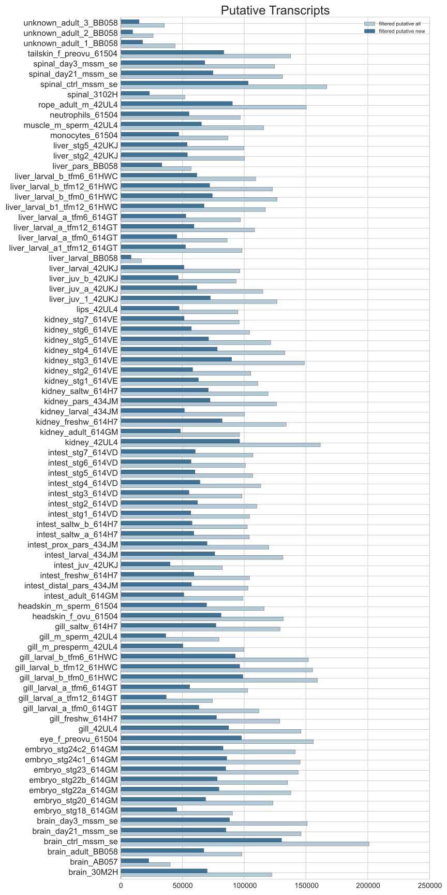
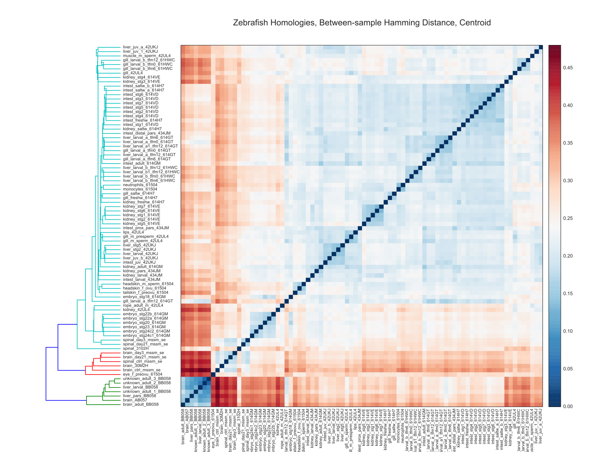

# Lamprey RNA-Seq 2014

## Between-sample Assembly Comparison

### Camille Scott (camille.scott.w@gmail.com)
### Michigan State University
### GED Lab
### https://github.com/camillescott/2013-lamprey/tree/lamp3

## Overview

The primary goal of this project has been to produce a scientifically usable set
of transcripts from our vast collection of RNA-seq samples. Given the lack of
completeness of the current lamprey genome, we chose to assemble the reads de
novo, using our in-house pipeline. The basics of the assembly pipeline can be
found in the _[Eel Pond protocol](https://khmer-
protocols.readthedocs.org/en/v0.8.4/mrnaseq/)_.

This document goes over the content of the resulting assembly with respect to
each sample used to construct it. We align every sample to the assembly, and use
an abundance estimation tool to get expression levels for each transcript, for
each sample. This allows us to analyze the extent to which each sample
contributed to the final assembly, and the relative representation of each
sample within the assembly. We consider a transcript _represented_ in a sample
if it has an estimated abundance greater than 1.0 from the reads in that sample.

An overview of the samples can be found [here](https://docs.google.com/spreadshe
et/ccc?key=0AqkPW_VPT5rAdEdmczhDeWg4UEZWdmh4dElqeXFiUlE&usp=sharing). This is
what I have been able to scrape up from various collaborators and sequencing
centers; some information is definitely missing, and some samples were
preprocessed before being given to me. As such, any comments on this document
are greatly appreciated, whether they be corrections or offers for original
versions of the data. Note that the second sheet has the key between the
original sample names and the id's being used in the current project.

For all plots, "filtered" means after the removal of known contaminants.

All the plots shown in this notebook, as well as many more supporting figures,
can be found in the full notebook in the previously linked github repository,
and can be viewed in rendered form _[here](http://nbviewer.ipython.org/github/ca
millescott/2013-lamprey/blob/lamp3/pub/tale_of_two_transcriptomes_compute.ipynb)
_.

## Validation

Briefly, we can show that the assembly is both valid and contains new
information with homologies to model organisms. Here, we show:

1. _**Putative new:**_ Transcripts with substantial protein homology to a model
species (mouse, zebrafish, or amphioxus) or substantial nucleotide homology to
the lamprey genome, but no homology with the existing lamprey transcripts or
ESTs.

2. _**All pututive:**_ Transcripts which have homologies in any one of the model
species, the lamprey genome, lamprey transcripts, or lamprey ESTs.

This is done for the transcripts represented in each sample:

Note that there is overlap between bars; that is, the sum under the "curve" is
much greater than the total number of transcripts in the assembly.

With that in mind, the distribution of the number of samples in which a
transcript is represented, along with genome homologies for each bin:

## Sample Comparison

Between sample comparisons seek to analyze both the transcript content and
transcript expression of different samples. The manner in which these metrics is
analyzed depends mostly on the *distance* metric used.

Briefly, let us have an assembly $T$, consisting of transcripts
$T=\{t_0,t_1,...,t_n\}$, where there are $n$ transcripts total. Let us also have
a set of samples $S$, were $S=\{s_0,s_1,...,s_m\}$, with $m$ samples total; In
our case, $m=84$.

Then each sample $s_i$ is a vector $\bar{s_i}=[ A_i(t_0),A_i(t_1),...,A_i(t_n)
]^T $, where

$$A_i(t_j) = \begin{cases}
1, & \text{if estimated abundance of transcript } t_j \text{ in sample } i
\text{ is } > 1.0 \\
0, & \text{otherwise}
\end{cases}$$

for simple sample transcript content, and

$$A_i(t_j) = \text{estimated abundance of transcript } t_j \text{ in sample }
i$$

for sample expression.

We then need only define a distance metric $D(s_a,s_b)$ two compare two samples.
This facilitates clustering and tree-building between all pairs of samples.

_**In qualitative terms**_, we simply have 84 lists, 1 for each sample, each of
which is a list of estimated abundances for each transcript. We'll do pairwise
comparisons of these lists.

The other important important choice is the clustering method. Two methods will
be demonstrated: the _centroid_ method and the _ward_ method. There are decent
descriptions of these in the [scipy clustering docs](http://docs.scipy.org/doc/s
cipy-0.13.0/reference/generated/scipy.cluster.hierarchy.linkage.html), with more
detailed descriptions on wikipedia and in many textbooks and papers. Briefly, in
the _centroid_ method, the distance between two clusters is the distance between
the mean positions of all elements in the clusters. It is noted as being robusts
to outliers, but potentially performing worse than other methods. In the _Ward_
method, the distance between two clusters is the _ANOVA_ sum of squares between
the two clusters; we seek to minimize the within-cluster sum of squares
distance. _Ward_'s method performs well with small $N$, and is strongly biased
toward producing clusters with the same number of observations. See
[here](http://v8doc.sas.com/sashtml/stat/chap23/sect12.htm) for these overviews.

### Sample Content: _Hamming Distance_

Hamming distance measures the number of disagreeing positions in a binary
vector, normalized by the length of the vector (number of transcripts in this
case). See the [scipy docs](http://docs.scipy.org/doc/scipy-0.13.0/reference/gen
erated/scipy.spatial.distance.hamming.html#scipy.spatial.distance.hamming) for a
detailed description of the metric used in these figures.

Qualitatively, this is a measure of how many transcripts are shared between the
two samples.

Here, the _Ward_ method appears to give better results.

### Sample Expression: _Correlation Distance_

Correlation distance is a measure of the statistical independence of two
distributions. Thus, it will take into account the estimated abundances, rather
than just considering if the transcripts are represented at all, as in the
Hamming distance. The [scipy docs](http://docs.scipy.org/doc/scipy-0.13.0/refere
nce/generated/scipy.spatial.distance.correlation.html#scipy.spatial.distance.cor
relation) once more have a good description of what was used for this figure;
further information is available on
[wikipedia](http://en.wikipedia.org/wiki/Distance_correlation). Notably, while
classically a correlation distance of $0.0$ implies complete statistical
independence, this implementation reports $1-CD(s_a,s_b)$; ie, $1.0$ implies
complete statistical independence.

Qualitatively, this is a measure of how similar the distribution of expression
levels (estimated abundances) is between two samples.

### Sample Expression: Specific Cases

We can also look at how the clustering changes with differing subsets of
transcripts. This could be of interest in regards to evolutionary changes.

First, we will take transcripts homologous to an amphioxus protein, but not to
mouse or zebrafish. Note that amphioxus shares a common ancestor with lamprey.

Next, we take transcripts homologous to mouse or zebrafish, but not to
amphioxus. Note that mouse and zebrafish and descendants of lamprey.

### Conclusions

For now, I'm leaving out any of my interpretations of the data. I welcome any
and all feedback, thoughts, ideas -- especially any thoughts on how this
analysis (and other similar analyses) that I can perform are useful for your
research.
